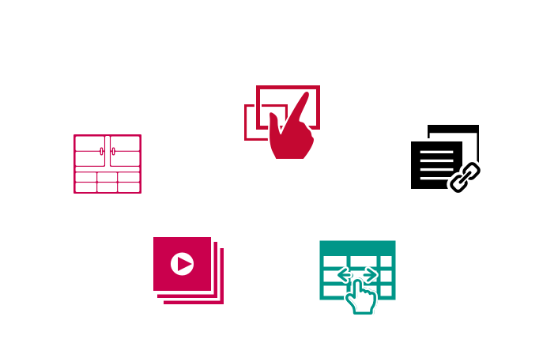

# アップルップルのOSS活動について

---

- OSS活動とは
- 弊社が配布しているオープンソース
- なぜOSS活動をするのか

---

# OSS活動とは

---

# OSS活動とは

だれもが無償で利用できるソースコードを公開する活動

---

# 弊社が配布しているオープンソース

- JavaScript 23プロジェクト
- PHP 9プロジェクト

  

---

# 弊社OSSのスターランキング

1. ★708 SmartPhoto 
2. ★261 LookForward
3. ★192 ScrollHint 
4. ★133 PrettyScroll 
5. ★122 ModalVideo 
6. ★117 FormStorage 
7. ★116 LiteEditor 
8. ★70  Hiraku
9. ★55  a-table
...

---

# 弊社OSSのスターランキング

今回はその中から5つ紹介

1. ★708 SmartPhoto  ←
2. ★261 LookForward
3. ★192 ScrollHint ←
4. ★133 PrettyScroll ←
5. ★122 ModalVideo 
6. ★117 FormStorage ←
7. ★116 LiteEditor 
8. ★70  Hiraku
9. ★55  a-table　←

---

# SmartPhoto
## ★ 708

- 設置が簡単
- イベントが取得できる
- Orieantation APIに対応
- 画像のグループ化ができる

---

# PrettyScroll
## ★ 133

- スクロール時にスクロール量に応じて要素を固定するためのJavaScript
- 「どの範囲まで固定するか」また「スマホ時はスクロールを中断するか否か」などそういった多くのシチュエーションに耐えうる

---

# FormStorage
## ★ 117

- 一度入力したフォームの入力内容の保存、復元を行ってくれるJavaScript

---

# a-table
## ★ 55

- テーブルのHTMLを生成するためのSpreadSheet風なUIのJavaScript
- MovableTypeにも採用されている

---

# なぜOSS活動をするのか

- Web制作業務の中で必要になって開発
- a-blog cms においてのUI開発の一つ
- GitHubでのissueやforkが製品のブラッシュアップに繋がる

---

# ぜひ使って見てください〜！

使ってみてよかったらスターもください〜

https://appleple.github.io/

---

# ありがとうございました！
